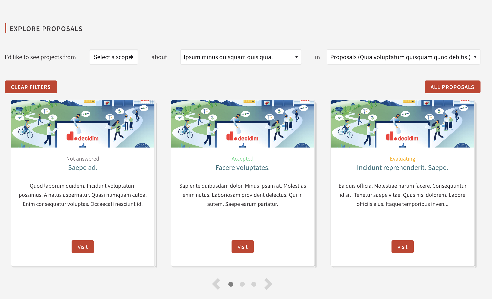

# Decidim::HomepageProposals

Proposals homepage content block presented as carousel. 



With this module you can have an overview of current proposals on the platform. Carousel support live reload based on selected filters and refreshing using Ajax requests.

## Requirements

* [GlideJS](https://github.com/glidejs/glide)

## Installation

Add this line to your application's Gemfile:

```ruby
gem "decidim-homepage_proposals"
```

And then execute:

```bash
bundle
bundle exec rake decidim_module_homepage_proposals:webpacker:install
bundle exec rake assets:precompile
```

## Usage in Decidim

* Go to the backoffice
* Navigate to homepage content blocks
* Configure the homepage proposals content block
* Enable content block

## Contributing

See [Decidim](https://github.com/decidim/decidim).

## License

This engine is distributed under the GNU AFFERO GENERAL PUBLIC LICENSE.
